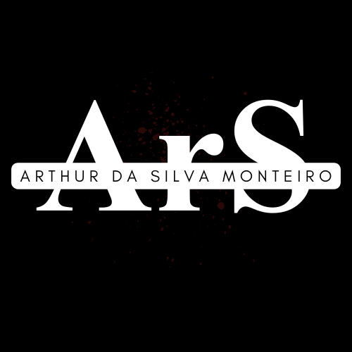
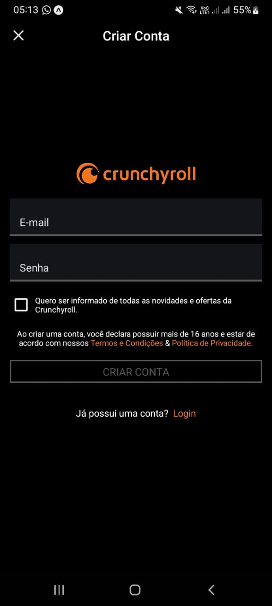

# ReactNative-ArS

  

    Repositório Individual Da Disciplina React-Native (Serratec).

# Projeto Clone CrunchyRoll

O projeto consiste em um clone do aplicativo CrunchyRoll, no qual a tela de cadastro foi replicada. Além disso, foi implementada uma segunda rota personalizada, na qual há um campo para que o usuário possa colocar o seu apelido que é composto por um TextInput que está vinculado a um state e a um botão (TouchableOpacity). 

<strong>Instruçoes:</strong>
Após preencher os campos na tela de cadastro e clicar no botão "Criar Conta" (TouchableOpacity) o usuário será direcionado para a segunda rota, aonde o seu apelido poderá ser inserido

  

    
    
<strong>Print da tela a ser clonada</strong>

  

  

    
    
<strong>Print do clone</strong>

  

